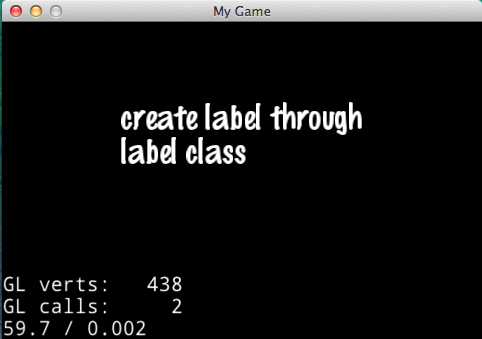
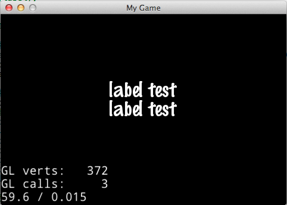
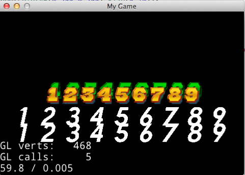

#Cocos2d-x 3.0对Label的改进
什么是Label，Label就是用来显示文本信息的，Cocos2d-x-3.0创建文本的方式较之前的版本发生了改变，原版本中的类CCLabelTTF,CCLabelBMFont,CCLabelAtlas现在合并为一个类Label,通过调用Label不同的创建方法来实现原版本的上述三个类的功能。相比于之前版本调用系统API来创建字符纹理的低效率，新的label使用了freetype第三方库来包装各个平台，做到了字符显示效果的一致，并且缓存了字符纹理提高了效率。下面就来看一下如何使用Label吧。

##一、Label的基本使用方法
使用create方法来创建label的时候，需要传入的参数较多，当然只有前三个参数是必须的，系统为后边的参数提供了默认值。  
	
	//第一个参数是要显示的文本内容，第二个参数不存在的话将会使用系统API来创建文本，存在的话内部调用的是createWithTTF创建，第四个参数是文本域的大小，第五个和第六个是对齐方式，后三个参数可以省略
		
	auto label = Label::create("create label through label class","fonts/Marker Felt.ttf",32,Size(240,160),TextHAlignment::LEFT,TextVAlignment::TOP);
    label->setPosition(Point(size.width/2,size.height/2));
    this->addChild(label);

   
###1、创建LabelTTF
 
LabelTTF对应于原来版本的CCLabelTTF，3.0的createWithTTF一开始要加载字符纹理，较2.x版本效率有明显提高。使用如下的俩种方式来创建LabelTTF,第一种方式传入参数的时候省略了后三个参数，第二个是使用结构体TTFConfig配置了Label的属性，为TTFConfig赋值的时候有些参数是必须的，而有些系统会提供默认参数。
 	
	//创建label的第一种方式，参数分别是显示的文本，所用的字体文件，文本大小
    auto label = Label::createWithTTF("label test","fonts/Marker Felt.ttf",32);
    label->setPosition(Point(size.width/2,size.height*0.6));
    this->addChild(label);
    
    //创建label的第二种方式，通过设置配置信息TTFConfig来创建文本，TTFConfig是一个结构体
    TTFConfig label_config;
    //fontFilePath设置所使用的字体文件，必须设置，其他的几项系统都有默认值
    label_config.fontFilePath = "fonts/Marker Felt.ttf";
    //fontSize设置字体大小
    label_config.fontSize = 32;
    //使用的字符集，字符集用于一开始缓存创建哪些字符纹理
    label_config.glyphs = GlyphCollection::DYNAMIC;
    //用户字符集
    label_config.customGlyphs = nullptr;
    //是文本显的更加紧凑
    label_config.distanceFieldEnabled = false;
    //字体锚边的大小
    label_config.outlineSize = 0;
    
    //传入配置信息和需要显示的文本
    auto label_two = Label::createWithTTF(label_config, "label test");
    label_two->setPosition(Point(size.width/2,size.height*0.5));
    this->addChild(label_two);

   
####1.1、以下来说明几个函数的用法
这些函数是设置文本的一些特殊效果，包括描边，阴影，荧光，行高和字符间距。    
    
    //设置描边的颜色，第二个参数可以传入描边的大小，大小不能为0，否则的话就看不到描边的效果了
    label_two->enableOutline(Color4B(255,0,0,255),5);
    //荧光的效果,distanceFieldEnabled需要设置为true,outlineSize为0
    label_three->enableGlow(Color4B(255,0,0,255));
    //阴影效果,第一个参数是影子的颜色，默认是黑色，第二个参数是偏移量， 第三个参数是模糊半径
    label_four->enableShadow(Color4B(0,0,255,255),Size(3,10),0);
 
###2、创建BMFont  
BMFont可以通过图片编辑软件二次编辑效果，做出你想要的文本样式，这就是BMFont存在的原因。为了使用BMFont，首先你需要准备一个.fnt文件和.png图片，在这些文件中包含了你想要的字符信息，这俩个资源是使用一些字体工具来获得的。传入参数的时候只需要传入.fnt就可以了。 	
	
	//创建BMFont，第一个参数是.fnt文件，第二个参数是要显示的文本，文本信息的内容必须包含在fnt的文件中，否则显示不出来
    auto bmfont = Label::createWithBMFont("fonts/gameover_score_num.fnt", "123456789");
    bmfont->setPosition(Point(size.width/2,size.height/2));
    //阴影效果，没有描边和荧光，因为是从PNG中读取的图片
    bmfont->enableShadow(Color4B(0,255,0,255),Size(5,10));
    this->addChild(bmfont);
    //取消所有特效
    //bmfont->disableEffect();

###3、创建CharMap
在2.x的时候CCLabelAtlas的存在是为了提高效率，它经常用来显示数字，3.xCharMap的存在一个是为了兼容之前的版本，另外也可以使用图片编辑软件二次编辑效果，做一些很炫的数字。资源文件同样是需要一些字体工具来做的，而且你还需要知道字符的宽和高，相比前俩种方式，显的比较费事。    
    
    //创建charMap 参数分别为：png图片的路径，每个字符的宽和高，起始字符
    auto charMap = Label::createWithCharMap("fonts/tuffy_bold_italic-charmap.png", 48, 64, ' ');
    charMap->setPosition(Point(size.width/2,size.height*0.4));
    //需要设置一下显示的文本信息
    charMap->setString("123456789");
    this->addChild(charMap);
    
    //也可以使用.plist文件来创建charMap
    auto charMap2 = Label::createWithCharMap("fonts/tuffy_bold_italic-charmap.plist");
    charMap2->setPosition(Point(Point(size.width/2,size.height*0.3)));
    //需要设置一下显示的文本信息
    charMap2->setString("123456789");
    this->addChild(charMap2);   
   
##二、较2.X版本的变化
* 去掉了类、结构体和宏的CC前缀和一些其他类似匈牙利命名方式的前缀，例如m、p等等；
* 改变了成员函数中某些参数和返回值的数据类型，比如char换成了string、unsigned int换成了long等等；
* 改变了某些枚举类型的名字和属性值；
* 将引擎中不会被修改数据成员的函数都声明成了const 类型，提高了程序的健壮性。    
    
    
    
    
    